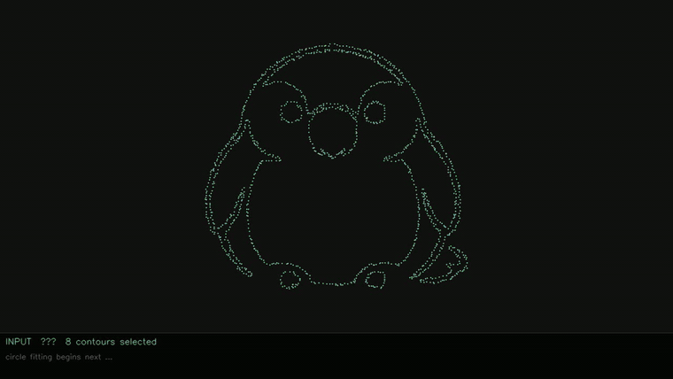

# circle_draw

Reconstruct image contours as fitted circle arcs, then render the selected arc
segments over an optional background.

## Example

The checked-in demo run lives in `outputs/demo_kakapo_logo/` and includes its
input image, result, config, and debug fitting videos.

**Input**


**Goal**


**Output**


**Debug fitting preview**



Full debug videos:

- [Fast MP4](outputs/demo_kakapo_logo/debug/fitting_fast.mp4)
- [Slow MP4](outputs/demo_kakapo_logo/debug/fitting_slow.mp4)
- [Run config](outputs/demo_kakapo_logo/config.json)

## Setup

Requires `libcairo2-dev` on the system (for pycairo).

```bash
sudo apt-get install libcairo2-dev pkg-config
uv sync
```

## Usage

```bash
uv run python scripts/run.py path/to/image.png outputs/
```

The command creates a timestamped run directory under `outputs/`. The default
canvas is 1920×1080. Kept contours are fitted and centered on the canvas
automatically; use `--no-center` to keep source-image coordinates.

Add `--debug` to write step-by-step fitting videos into the run's `debug/`
directory.
