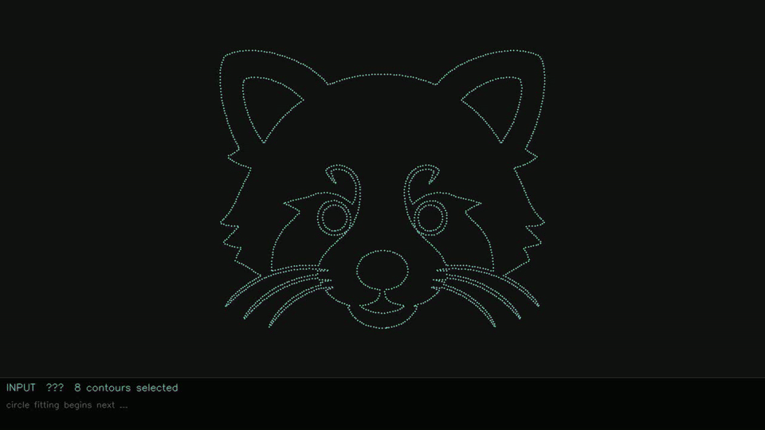

# circle_draw

Reconstruct image contours as fitted circle arcs, then render the selected arc
segments over an optional background.

## Example

The primary checked-in demo is now `outputs/demo_red_panda_logo/` and includes
its input image, result, config, and debug fitting videos. It matches the
current "Run Custom Debug" profile:

```bash
uv run python scripts/run.py input/red_panda_logo.png outputs/ \
	--width 1920 --height 1080 --threshold 159.0 --step 5 \
	--contour-leveling-scale 0.35 --contour-turn-preserve-threshold 0.75 \
	--contour-turn-preserve-radius 1 --min-points 20 --min-circles 1 \
	--quality-threshold 0.8 --forward-k 10 --backward-k 100 --padding 0.08 \
	--sharp-turn-method poly --poly-window-radius 10 --poly-high-degree 8 \
	--poly-improvement-ratio 2.5 --max-circle-radius 500 \
	--sharp-turn-min-count 2 --cv2-no-equalize --cv2-denoise-h 8 \
	--background-scale 0.8 --debug
```

**Input (Red Panda)**


**Goal**


Contours are leveled after extraction using a downsample/upscale pass. Tune with
`--contour-leveling-scale`, `--contour-turn-preserve-threshold`, and
`--contour-turn-preserve-radius` to reduce noise while keeping real corners.

**Output (Red Panda)**


**Debug fitting preview (Red Panda)**



Full debug videos (Red Panda):

- [Fast MP4](outputs/demo_red_panda_logo/debug/fitting_fast.mp4)
- [Slow MP4](outputs/demo_red_panda_logo/debug/fitting_slow.mp4)
- [Run config](outputs/demo_red_panda_logo/config.json)

Additional preserved demo (Kakapo):

- [Kakapo input](outputs/demo_kakapo_logo/input.png)
- [Kakapo result](outputs/demo_kakapo_logo/result.png)
- [Kakapo fast MP4](outputs/demo_kakapo_logo/debug/fitting_fast.mp4)
- [Kakapo slow MP4](outputs/demo_kakapo_logo/debug/fitting_slow.mp4)
- [Kakapo config](outputs/demo_kakapo_logo/config.json)

## Setup

```bash
uv sync
```

## Acknowledgements

Many ideas in this project were inspired by the following papers:

- Walter Gander, Gene H. Golub, and Rolf Strebel (1994), *Least-Squares Fitting of Circles and Ellipses*.
- Eric Saund (1993), *Identifying Salient Circular Arcs on Curves* (Xerox PARC Technical Report SPL-93-017).
